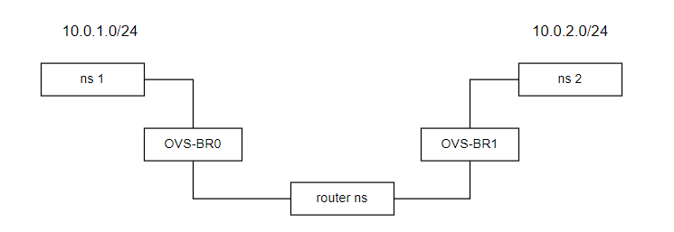
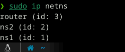
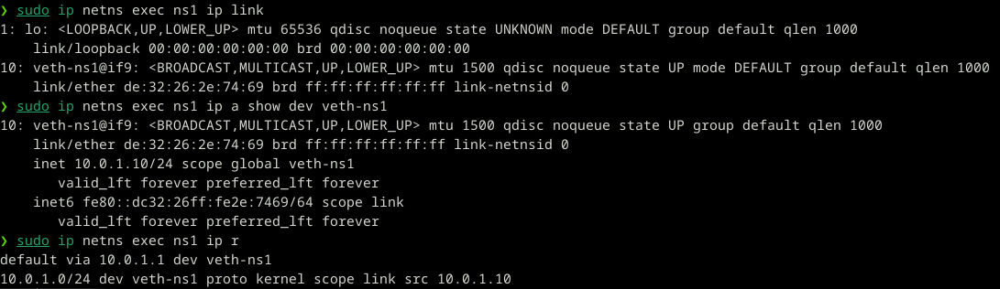
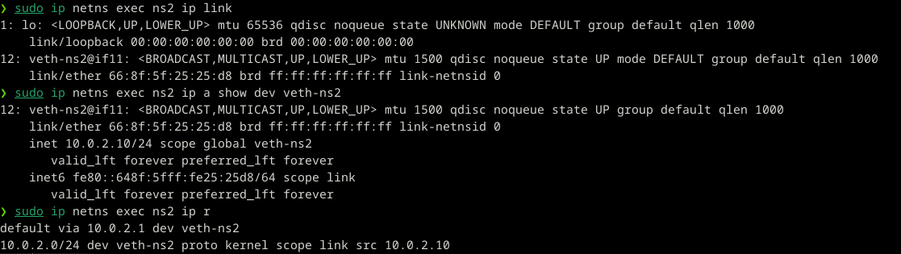
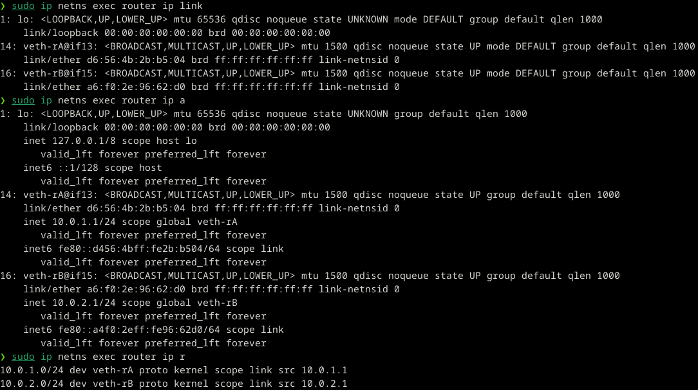
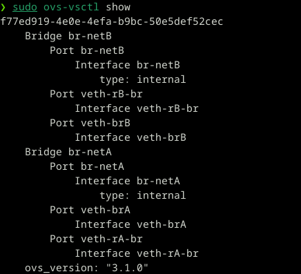
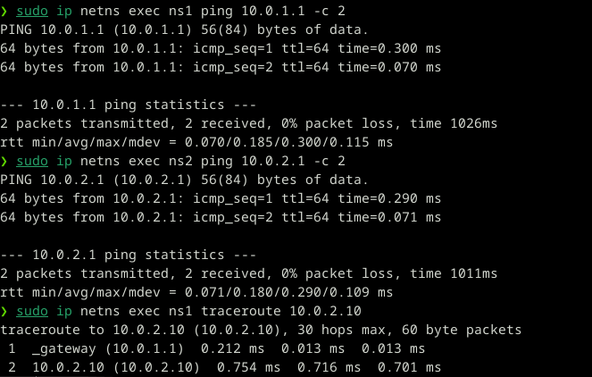

## Схема сети

## Цель
Построить простую виртуальную L2/L3 сеть в Linux с использованием namespaces, veth и OVS.
## Описание
В сети реализованы:  
- 2 изолированных клиентских сегмента (netA и netB)  
- 2 клиента (ns1 и ns2)  
- L2 коммутаторы на базе Open vSwitch  
- L3 маршрутизатор на базе отдельного network namespace
**Namespace 1 (client A)**
- IP: 10.0.1.10/24
- gateway: 10.0.1.1
**Namespace 2 (client B)**
- IP: 10.0.2.10/24
- gateway: 10.0.2.1
**Router namespace (L3 router)**
- 2 интерфейса:
- 10.0.1.1 (netA)
- 10.0.2.1 (netB)
- включён IP forwarding
**OVS bridges**
- br-netA
- br-netB
## Процесс настройки
#### 1. Создание сетевых namespace-ов
Были созданы network namespace-ы для изоляции сетевых узлов:  
- **ns1** клиент в сети 10.0.1.0/24  
- **ns2** клиент в сети 10.0.2.0/24  
- **router** узел маршрутизации между подсетями
#### 2. Формирование L2 сегментов
С помощью Open vSwitch были созданы два виртуальных коммутатора:  
- **br-netA** — для сети 10.0.1.0/24  
- **br-netB** — для сети 10.0.2.0/24  
Каждый коммутатор объединяет соответствующие сетевые интерфейсы.
#### 3. Соединение через veth
Между namespace и коммутатором были созданы veth-пары
#### 4. Настройка маршрутизатора
Namespace router выполняет функции L3 маршрутизатора:  
- осуществляет пересылку пакетов между сетями  
- выполняет роль шлюза по умолчанию для клиентов
#### 5. Настройка сетевых параметров
Для всех узлов были назначены IP-адреса и маршруты по умолчанию. Маршрутизация между подсетями осуществляется через router namespace.
## Результат настройки
#### Конфигурация namespace-ов

**Настройки ns1**

**Настройки ns2**

**Настройки router**

**Настройки OVS**

**Тестирование связанности и маршрута**

