## Схема сети

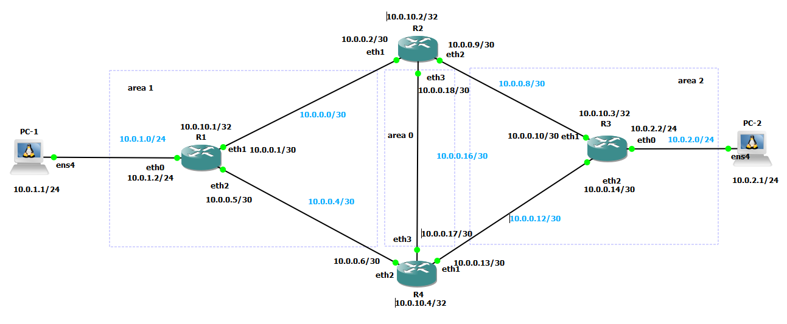
## Цель
Продемонстрировать настройку OSPF маршрутизации с разделением на несколько областей.
## Описание
В рамках работы была построена и настроена динамическая маршрутизация с использованием протокола OSPF с разделением сети на несколько областей.
Сетевая топология включает:
- backbone-область (area 0)
- две пользовательские области (area 1 и area 2)
- четыре маршрутизатора, соединённые между собой избыточными линками
- PC-1 и PC-2, подключённые к граничным маршрутизаторам
Архитектура сети построена по принципу звезды, как того требует OSPF
## Процесс настройки
#### 1. Базовая настройка сетевых интерфейсов
На интерфейсах маршрутизаторов и конечных узлов были настроены IP адреса согласно рисунку. У конечных узлов были заданы шлюзы по умолчанию, указывающие на соответствующие интерфейсы граничных маршрутизаторов.
Так же на роутерах были настроены router-id(в соответствии с loopback адресами) 

#### 2. Распределение сетей по областям
Сети были добавлены в соответствующие им области согласно схеме, на данном этапе появилась связанность между PC-1 и PC-2.
Результат ping-а на PC-1 до PC-2:

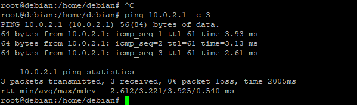

#### 3. Минимальная оптимизация
Для исключение лишних Hello пакетов в пользовательских участках сети все интерфейсы, подключенные к PC-1 и PC-2 были переведены в режим passive-interface
Все межмаршрутизаторные соединения были переведены в режим point-to-point, что позволило уменьшить количество LSA пакетов и упростило LSDB 
#### 4. Проверка корректности настроек
**Состояние OSPF соседств**
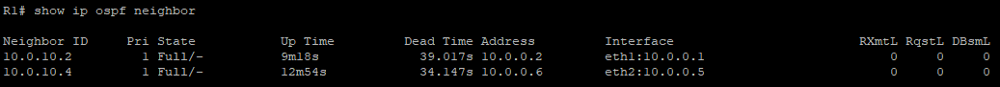
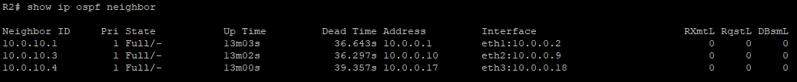
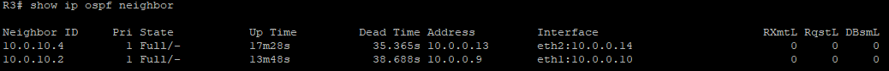
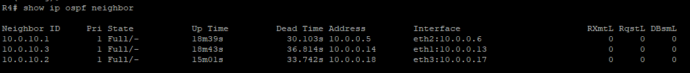
Все в норме
**Состояние таблицы маршрутизации**
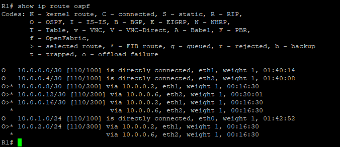
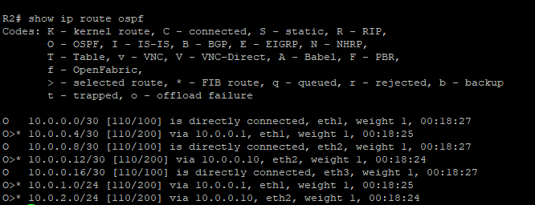
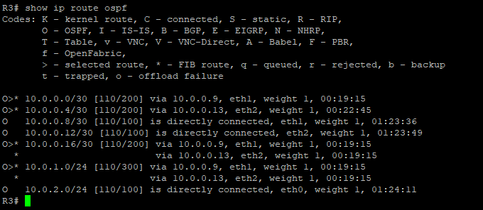
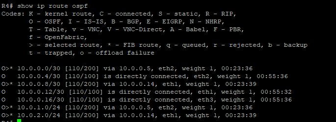

**Состояние LSDB**

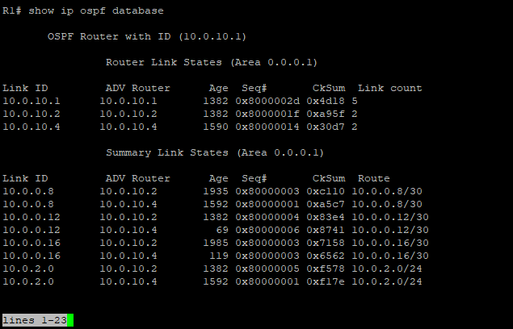
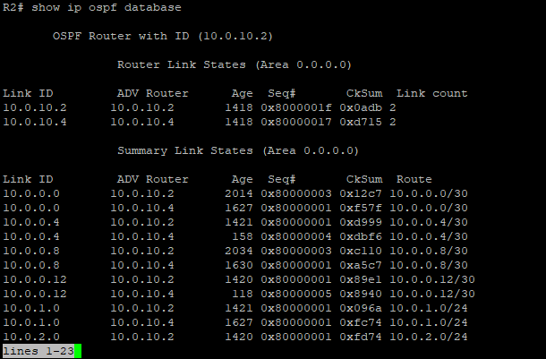
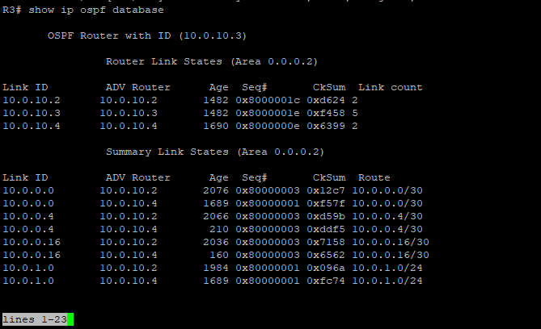
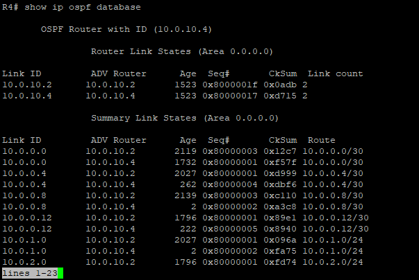
**Проверка связанности**
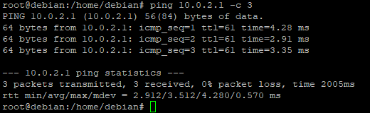
#### 5. Изменение стоимости маршрута
**Маршрут до изменения стоимости линков**
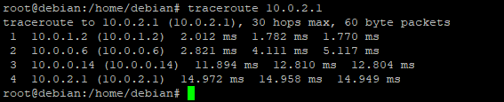
По выводу команды можно понять, что пакет идет таким образом:
PC1 - R1 - R4 - R3 - PC2, смешно же будет, если мы пакетики захуярим по другому маршруту
**Изменение стоимости**
Поменяем на обоих концах линка, соединяющего R1 и R4, цену на 250
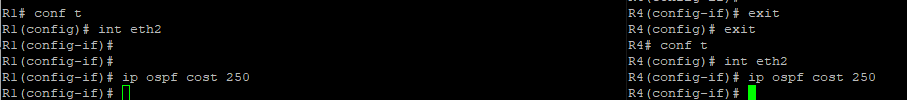
**Маршрут после изменения стоимости линков**
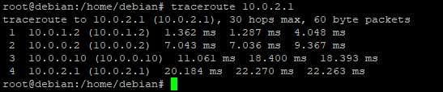
Можно заметить, что теперь пакет идет так:
PC1- R1 - R2 - R3 - PC2
Что говорит об успешном изменении стоимости маршрута
