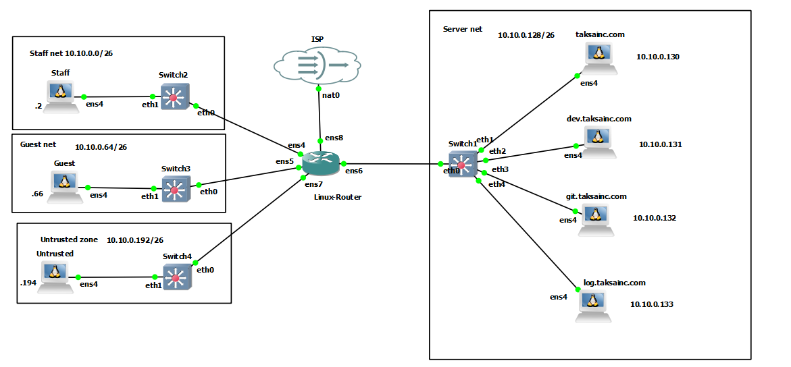
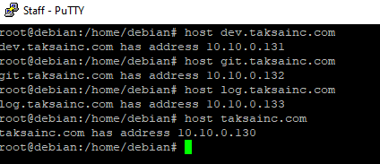
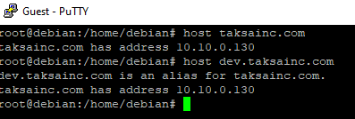
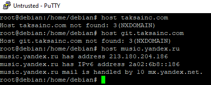

# Схема сети

## Цель
Необходимо настроить DNS-сервер таким образом, чтобы:
- сотрудники и клиенты компании могли зайти на `taksainc.com` по доменному имени через браузер;
- сотрудники компании получали доступ к внутренним ресурсам по доменным именам `dev.taksainc.com`, `git.taksainc.com` и `log.taksainc.com`, а при обращении к `prod.taksainc.com` использовалось перенаправление на `taksainc.com`;
- клиенты не могли обращаться к внутренним сервисам компании (кроме `taksainc.com`), а запросы на `dev.taksainc.com`, `git.taksainc.com`, `log.taksainc.com` и `prod.taksainc.com` перенаправлялись на `taksainc.com`;
- все хосты из недоверенной подсети не могли обращаться ни к каким внутренним ресурсам в домене `taksainc.com`, а все такие запросы перенаправлялись на сервер `8.8.8.8`;
- все остальные запросы для разрешения других доменных имен от всех хостов в сети компании перенаправлять на DNS-сервер `8.8.8.8`.
## Описание
Предположим, нам требуется настроить внутренний DNS-сервер в компании `TaksaInc`, которая занимается разработкой программного обеспечения для такс. Ее ресурсы находятся в домене `taksainc.com`. Сеть компании 10.10.0.0/24 разделена на подсети:
- 10.10.0.0/26 - внутренняя подсеть для сотрудников компании,
- 10.10.0.64/26 - внешняя подсеть для клиентов с гостевым доступом,
- 10.10.0.128/26 - подсеть, выделенная для серверов,
- 10.10.0.192/26 - недоверенная публичная подсеть, к которой могут подключаться любые устройства.
## Конфигурационные файлы
**Основной файл конфигурации**
```bash
/etc/bind/named.conf
...
include "/etc/bind/taksainc/named.conf.options";
include "/etc/bind/taksainc/named.conf.local";
include "/etc/bind/taksainc/named.conf.acl";


```
**ACL**
```bash
/etc/bind/taksainc/named.conf.acl

acl "Staff" {
    localhost;
    10.10.0.0/26;
    10.10.0.128/26;
    };
acl "Guest" {
    10.10.0.64/26;
    };
acl "Untrusted" {
    10.10.0.192/26;
    };

```
**Общие настройки DNS**
```
/etc/bind/taksainc/named.conf.options

acl taksainc {
        10.10.0.0/24;
        localhost;
};

options {
        directory "/var/cache/bind";
        recursion yes;

        allow-query { taksainc; };

        forward only;
        forwarders { 8.8.8.8; };

        max-cache-size 128M;

        listen-on-v6 { none; };
        listen-on { 127.0.0.1; 10.10.0.130; };

        auth-nxdomain no;
};

```

**Основной файл локальной конфигурации**
```bash
/etc/bind/taksainc/named.conf.local

view "Staff" {
        match-clients { Staff; };
        zone "taksainc.com" {
                type master;
                file "/etc/bind/taksainc/zones/db.staff.taksainc.com";
        };
        zone "0.10.10.in-addr.arpa" {
                type master;
                file "/etc/bind/taksainc/zones/db.staff.0.10.10.in-addr.arpa";
        };
};
view "Guest" {
        match-clients { Guest; };
        zone "taksainc.com" {
                type master;
                file "/etc/bind/taksainc/zones/db.guest.taksainc.com";
        };
        zone "0.10.10.in-addr.arpa" {
                type master;
                file "/etc/bind/taksainc/zones/db.guest.0.10.10.in-addr.arpa";
        };
};
view "Untrusted" {
        match-clients { Untrusted; };
        zone "taksainc.com" {
                type forward;
                forwarders { 8.8.8.8; };
        };
};
view "LocalZones" {
        zone "." {
                type hint;
                file "/usr/share/dns/root.hints";
        };
        zone "localhost" {
                type master;
                file "/etc/bind/db.local";
        };
        zone "127.in-addr.arpa" {
                type master;
                file "/etc/bind/db.127";
        };
        zone "0.in-addr.arpa" {
                type master;
                file "/etc/bind/db.0";
        };
        zone "255.in-addr.arpa" {
                type master;
                file "/etc/bind/db.255";
        };
};

```
**Зоны(/etc/bind/taksainc/zones/)**
```bash
db.guest.taksainc.com

;
$TTL    60
$ORIGIN taksainc.com.
@       IN      SOA    ns1.taksainc.com. root.taksainc.com. (
                              3         ; Serial
                         604800         ; Refresh
                          86400         ; Retry
                        2419200         ; Expire
                         604800 )       ; Negative Cache TTL
;
        IN      A       10.10.0.130
        IN      NS      ns1.taksainc.com.
ns1     IN      A       10.10.0.130
dev     IN      CNAME   taksainc.com.
git     IN      CNAME   taksainc.com.
log     IN      CNAME   taksainc.com.
prod    IN      CNAME   taksainc.com.

```

```bash
db.guest.0.10.10.in-addr.arpa

;
$TTL    60
$ORIGIN 0.10.10.in-addr.arpa.
@       IN      SOA    ns1.taksainc.com. root.taksainc.com. (
                              3         ; Serial
                         604800         ; Refresh
                          86400         ; Retry
                        2419200         ; Expire
                         604800 )       ; Negative Cache TTL
;
@         IN      NS      ns1.taksainc.com.
130       IN      PTR     taksainc.com.


```

```bash
db.staff.taksainc.com

;
$TTL    60
$ORIGIN taksainc.com.
@       IN      SOA    ns1.taksainc.com. root.taksainc.com. (
                              3         ; Serial
                         604800         ; Refresh
                          86400         ; Retry
                        2419200         ; Expire
                         604800 )       ; Negative Cache TTL
;
        IN      A       10.10.0.130
        IN      NS      ns1.taksainc.com.
ns1     IN      A       10.10.0.130
dev     IN      A       10.10.0.131
git     IN      A       10.10.0.132
log     IN      A       10.10.0.133
prod    IN      CNAME   taksainc.com.

```

```bash
db.staff.0.10.10.in-addr.arpa

;
$TTL    60
$ORIGIN 0.10.10.in-addr.arpa.
@       IN      SOA    ns1.taksainc.com. root.taksainc.com. (
                              3         ; Serial
                         604800         ; Refresh
                          86400         ; Retry
                        2419200         ; Expire
                         604800 )       ; Negative Cache TTL
;
@         IN      NS      ns1.taksainc.com.
130       IN      PTR     taksainc.com.
131       IN      PTR     dev.taksainc.com.
132       IN      PTR     git.taksainc.com.
133       IN      PTR     log.taksainc.com.
```


## Проверка работы
**Staff:**

**Guest:**

**Untrusted**


## Вывод
## Вывод
В ходе работы был настроен DNS-сервер BIND9 с разделением доступа на основе ACL и views.

Для сотрудников был предоставлен доступ к внутренним сервисам компании, для клиентов настроено перенаправление внутренних ресурсов на основной сайт, а для недоверенной подсети реализована переадресация DNS-запросов на внешний DNS-сервер 8.8.8.8.

Также были настроены прямые и обратные DNS-зоны и выполнена проверка работы с различных подсетей.
