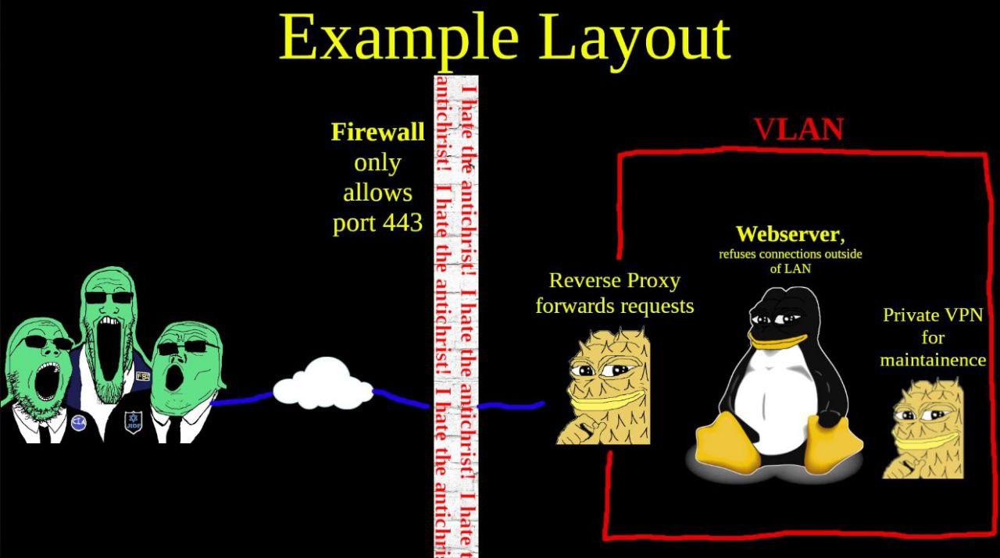
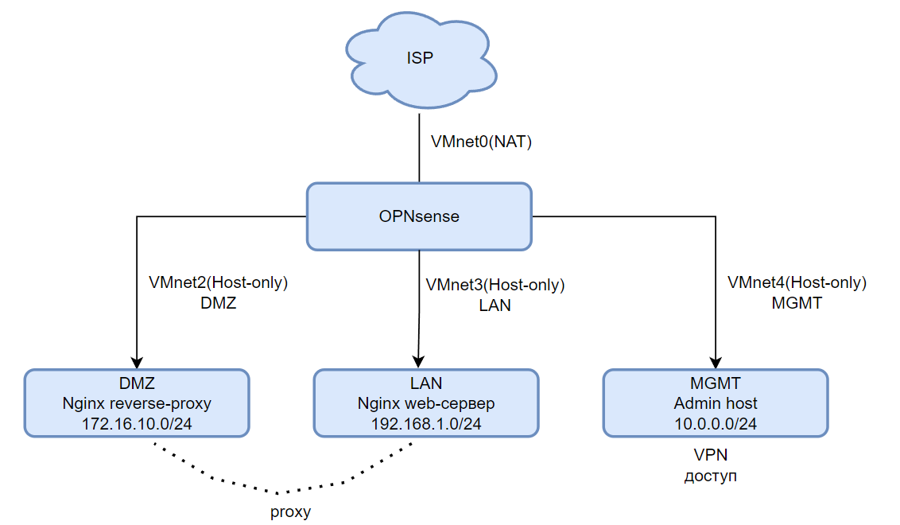

## Схема сети

## Цель
Построить сегментированную корпоративную сеть в VMware Workstation с централизованным межсетевым экраном OPNsense, демонстрирующую принципы сетевой изоляции, минимизации поверхности атаки и безопасного удалённого администрирования.
## Описание
Сеть разделена на четыре зоны: **WAN**, **DMZ**, **LAN**, **MGMT**. Центральный узел это OPNsense, выполняющий функции маршрутизатора, NAT, firewall и VPN-шлюза. Политика по умолчанию deny-all, трафик разрешается явными правилами. Схема вдохновлена мемом с Wojack-ами

|Зона|Подсеть|Назначение|
|---|---|---|
|WAN|—|Имитация интернета|
|DMZ|172.16.10.0/24|Nginx reverse proxy|
|LAN|192.168.1.0/24|Внутренний веб-сервер|
|MGMT|10.0.0.0/24|Администрирование|

## Процесс настройки
Пока деалаю ( ͡~ ͜ʖ ͡°)
